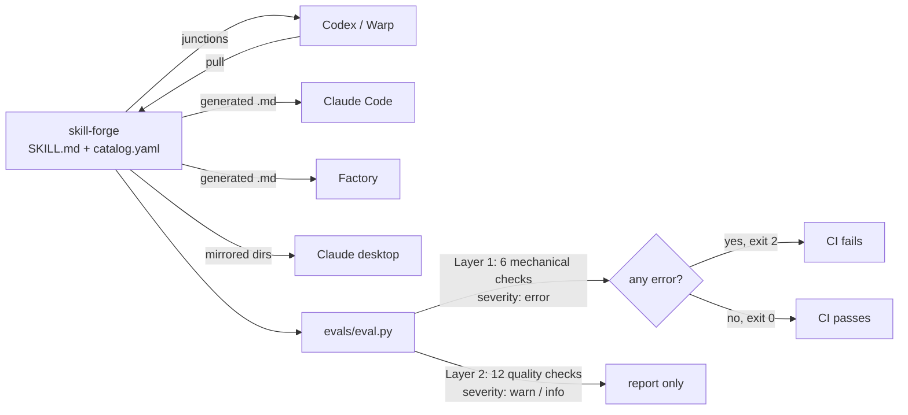

# Case Study: skill-forge

An engineering report on treating an AI skill library as software: one source of truth, a schema, a linter, and CI.

**Status:** the platform (sync engine, eval harness, schema) is the public artifact. The skills in this tree are the test corpus that keep the gate honest. Personal and project-scoped skills stay private so they cannot mislead an agent working in someone else's codebase.

---

## 1. The business problem

Agent skills are context that gets loaded on demand. Write a dozen of them and everything is fine. Write sixty across four tools and the library starts rotting in ways that never throw an error:

- A `description` gets edited into a summary instead of a trigger, so the agent stops loading the skill. The skill still exists, still looks correct, and is now dead weight.
- Two skills cross-reference each other, one gets renamed, and the link dangles silently.
- A skill written for one project mentions that product by name. It then fires in an unrelated repo and gives confidently wrong advice.
- A skill grows to 400 lines and burns more context than it saves.
- The copy in the Claude directory drifts from the copy in the Codex directory, and there is no way to tell which one is current.

Every one of these degrades agent behavior while every file still parses. The cost lands as "the agent is getting worse and I do not know why," which is expensive to debug precisely because nothing failed.

The same problem shows up on any team standardizing agent behavior across more than a couple of people. Prompt and skill libraries get treated as documentation, so they get documentation's quality controls, which is to say none.

## 2. Constraints

- **Four tools, three sync semantics.** Codex reads a directory and can write back. Claude Code and Factory need generated markdown in their own formats and must be one-way. The Claude desktop app needs mirrored directories under a path containing two GUIDs that change if the app reinstalls.
- **Windows primary, POSIX secondary.** The daily driver is Windows, so PowerShell is the reference implementation, with a Bash port that has to stay behavior-compatible.
- **No server, no database.** The library has to work as a git repo and nothing else.
- **The gate has to be cheap.** A quality check that takes two minutes will get skipped. This one needs to run in seconds.

## 3. Approach

One canonical repo. Every skill is a directory with `SKILL.md` (frontmatter plus instructions) and `catalog.yaml` (machine-readable metadata). A sync engine pushes to each tool in that tool's native format. An eval harness lints the whole library and gates CI.

## 4. Design decisions

**Junctions for Codex, generated files for everything else.**
Codex reads skills from a directory, so an NTFS junction makes the library and the tool the same bytes. Claude and Factory need different file formats, so those are generated with an auto-generated marker in the header.
*Alternatives:* generate for all four, or symlink all four.
*Why:* bidirectional sync is worth real complexity only where authoring actually happens. Skills get written in Codex, so that path is bidirectional. Nobody authors in the Factory droids directory, so making it writable would only create a way to lose work on the next push. The marker in generated headers is what lets `pull` tell a generated file from a hand-authored one.

**Two files per skill instead of one.**
`SKILL.md` frontmatter holds what the agent reads (`name`, `description`). `catalog.yaml` holds what the tooling reads (`id`, `origin`, `kind`, `tags`, `targets`, `scope`, `related`).
*Alternatives:* put everything in the frontmatter.
*Why:* the frontmatter is loaded into the agent's context on every match, so every key in it costs tokens forever. Sync targets and cluster membership are useless to the agent and essential to the tooling. Splitting them keeps the agent-facing surface minimal.

**`scope: general | project` as a hard gate on promotion.**
Project-scoped skills are never pushed to Claude or Factory targets.
*Alternatives:* trust authors to write portable skills.
*Why:* this is the failure that produces confidently wrong output rather than an obvious break. A skill that assumes one codebase will happily fire in another. Making scope a required field with an enforced consequence turns a judgment call into a mechanical one. A companion check flags project names appearing in general-scope bodies.

**`related` enforced in both directions.**
If A lists B, B must list A.
*Alternatives:* one-way links, or no link validation.
*Why:* one-way links rot asymmetrically. You delete B, A still points at it, and nothing notices until an agent follows a dead reference. Bidirectional enforcement means the graph is either consistent or the build is red.

**Three severities, but only errors fail the build.**
Six mechanical checks are errors. Twelve quality checks are warnings and infos.
*Alternatives:* fail on any finding.
*Why:* a gate that fails on style opinions gets disabled within a week. Errors are things that are objectively broken: unparseable files, missing required keys, an `id` that does not match its directory. Warnings are judgment: description length, size discipline, missing scope boundaries. Currently 29 infos are outstanding and the build is green, which is the intended state. The 28 `out_of_scope_clarity` infos are a standing invitation, not a defect.

**Freshness measured from git history, not a field.**
The harness reads `git log` to date each skill, which is why CI checks out with `fetch-depth: 0`.
*Alternatives:* a `last_reviewed` field in `catalog.yaml`.
*Why:* a self-reported date is a field people forget to update, which makes it worse than no field. Git already knows.

**Python harness is the source of truth; the PowerShell lint enforces a subset.**
*Alternatives:* one implementation.
*Why:* the pre-commit path has to be instant and dependency-free, so `sync.ps1 lint` implements only the stable mechanical checks. The Python harness owns the full rubric and runs in CI. Checks get promoted from Python to PowerShell once they stop changing. This is a deliberate duplication with a documented direction of travel.

## 5. Results

**Measured on this repository:**

| | |
|---|---|
| Skills in the public tree | 38 (the test corpus, not the product) |
| Errors | 0 |
| Warnings | 0 |
| Grade A | 38 of 38 — this is a linter grade (0 errors, 0 warnings), not a claim that the skills are effective |
| Infos outstanding | advisory, non-blocking (`out_of_scope_clarity` and similar) |
| CI runtime | ~17 seconds |

The eval workflow passed on the first push, from a cold checkout, with no local state.

**The extraction was itself a test of the harness.** Pulling 38 skills out of a 67-skill library broke exactly two cross-links (`eval-framework` pointed at a skill left behind, and so did `photo-geolocator`). The harness caught both, plus a bidirectional violation introduced by the fix. That is the check earning its keep: a manual extraction of this size would otherwise have shipped dangling references, and nothing would have surfaced them until an agent followed one.

**What is not measured:** whether the skills make agents measurably better. The harness validates structure and consistency, not effectiveness. A skill can score grade A and still give bad advice. That gap is the honest limitation of the whole approach.

**What was removed from the public tree:** a vendored Cloudflare docs dump under `cloudflare-deploy/references/` (300+ markdown files). The skill is a decision tree that points at official docs. Shipping a documentation mirror next to a linter made the repo look larger than the platform.

## 6. What I would improve

**Measure skill effectiveness, not just skill hygiene.** The obvious next layer is an eval that runs a task with and without a given skill loaded and scores the difference. That converts "this skill is well-formed" into "this skill is worth its context budget," which is the question that actually matters. It is also the expensive one, since it needs real tasks and a judge.

**Track context cost per skill.** Every skill has a token weight and no current visibility into it. A `size_discipline` warning fires on line count, which is a proxy. Real token counts per skill, summed per tool, would make the budget legible.

**Collapse the two lint implementations.** Maintaining a PowerShell subset alongside the Python harness is a tax that only pays while the rubric is still moving. Once it stabilizes, the right answer is one implementation invoked from both paths.

**Fix the desktop sync fragility properly.** The Claude desktop target lives under a path with two GUIDs that change on reinstall. Both scripts detect the vanished directory and print recovery steps, which is a workaround, not a fix. Discovering the path at runtime would be better.

**Make `PROJECT_NAMES` configurable.** It is a module-level constant in `eval.py`, which means anyone adopting this repo has to edit Python to configure it. It belongs in a config file.
