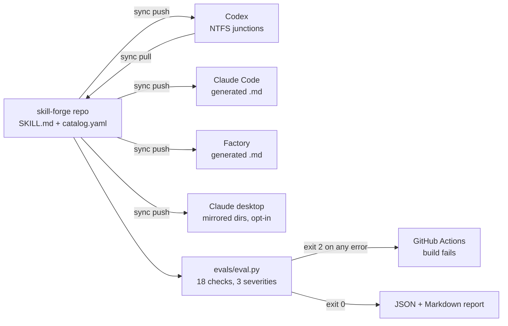

# skill-forge

**An 18-check CI gate for AI coding-agent skills.** A malformed skill does not throw. It just quietly makes the agent worse. This repo treats the library as software: one source of truth, a schema, a linter, and a build that fails on errors.

[](https://github.com/VJDiPaola/skill-forge/actions/workflows/eval.yml)

The skills in this tree are the test corpus. The product is the harness.

📋 **[Read the case study](./CASE-STUDY.md)** for the design decisions, measured results, and what the linter cannot catch.

---

## The problem this solves

Once you write more than a dozen agent skills, they rot in ways that are invisible until an agent behaves badly:

- A skill's `description` stops describing when to trigger it, so the agent never loads it.
- Two skills cross-reference each other, one gets renamed, and the link silently dangles.
- A skill written for one project leaks a product name and starts misfiring in unrelated repos.
- A skill grows to 400 lines and blows the context budget it was supposed to save.
- The copy in your Claude directory drifts from the copy in your Codex directory, and you cannot tell which is current.

None of these throw an error. This repo is the quality gate those failures never had.

## How it works



Codex is bidirectional through directory junctions, so a skill authored in Codex flows back. Claude and Factory get generated files with an auto-generated header marker, one way only, because hand-edits there would be overwritten on the next push.

## Quickstart

```bash
git clone https://github.com/VJDiPaola/skill-forge.git ~/skill-library
cd ~/skill-library
pip install -r evals/requirements.txt
```

Run the quality gate:

```bash
python evals/eval.py
python evals/test_behavior.py   # fixture check for a high-stakes skill
```

Sync to your tools:

```bash
./sync.sh push          # or .\sync.ps1 push on Windows
./sync.sh status
./sync.sh pull          # bring back skills authored in Codex
```

Target one tool: `./sync.sh push codex`

## The eval harness

`evals/eval.py` runs 18 checks in two layers. Exit code is `0` when clean and `2` when any error-severity issue is present, which is what makes it usable as a CI gate.

**Layer 1, mechanical.** Every skill must load, must have `name` and `description` in frontmatter, must carry all six required `catalog.yaml` keys, must have an `id` matching its directory, must declare a valid scope, and must target at least one tool. Any failure here is an error and fails the build.

**Layer 2, quality.** Description length and trigger phrasing, cross-link integrity in both directions, cluster membership consistency, size discipline, freshness measured against git history, and category conventions. A security skill that never references CWE, CVE, OWASP, or a severity level gets flagged. These are warnings and infos, so they surface without blocking.

This is a linter, not a proof that the skills make agents better. A skill can pass every check and still give bad advice. Grade A means 0 errors and 0 warnings on structure. It does not mean the skill is effective.

```bash
python evals/eval.py --stdout --format markdown   # full report to stdout
python evals/eval.py --skill playwright           # one skill
python evals/eval.py --scope all                  # include project-scoped
```

## Skill anatomy

Every skill is a directory with two files:

```
my-skill/
  SKILL.md        # frontmatter (name, description) + the instructions
  catalog.yaml    # machine-readable metadata
```

```yaml
id: autonomy-map
origin: claude
kind: skill
tags: [evals, ai-product, methodology]
targets:
  codex: true
  claude: true
  desktop: true
  factory: false
scope: general
related: [eval-framework, behavior-spec-canvas, api-prompt-optimizer]
```

`scope` is the important one. `general` skills are safe anywhere. `project` skills name a specific product and are never promoted to Claude or Factory targets, because a skill that assumes one codebase will mislead an agent working in another.

`related` is enforced in both directions. If A lists B, B must list A, or the harness warns.

## What is in here

The tree is a working library used to exercise the harness, not a catalog to star. High-stakes skills get a fixture check in `evals/test_behavior.py` in addition to the linter.

**Agent and AI design** `autonomy-map` · `behavior-spec-canvas` · `eval-framework` · `api-prompt-optimizer`

**Security** `security-audit` · `security-best-practices` · `security-ownership-map` · `security-threat-model`

**Engineering** `api-design-review` · `database-design` · `docker-debug` · `git-workflows` · `testing-strategy` · `gh-fix-ci` · `pr-shell-safety-pack` · `react-query-test-harness-fixer` · `api-drift-scout` · `scrutiny-feature-reviewer` · `user-testing-flow-validator`

**Deployment** `cloudflare-deploy` · `repo-first-vercel-build` · `worker` · `seeded-catalog-sync`

`cloudflare-deploy` is a decision-tree skill that points at official Cloudflare docs. It is not a vendored copy of developers.cloudflare.com.

**Media and capture** `pdf` · `screenshot` · `photo-geolocator` · `transcribe` · `speech` · `imagegen` · `playwright` · `playwright-interactive`

**UI generation** `3d-bloom-scene` · `force-graph-3d` · `glassmorphic-ui` · `interactive-artifact-generator` · `sdk-ui-override-specialist`

**Windows environment** `windows-cli-wsl-repair` · `windows-node-sandbox-troubleshooting`

## Adding a skill

1. Create the directory with `SKILL.md` and `catalog.yaml`.
2. Write the `description` as a trigger, not a summary. The agent decides whether to load the skill from this line alone.
3. If it belongs to a cluster, add `related` on both sides.
4. Run `python evals/eval.py --skill <name>`.
5. Run `./sync.sh push`.

`AGENTS.md` is the contributor guide for agents working in this repo, including the full rubric and the pitfalls the linter cannot catch.

## Adapting this for yourself

Two things are specific to the author's setup and worth changing:

- `PROJECT_NAMES` in `evals/eval.py` is empty. Add your own product and repo names so the harness catches project leakage into general-scope skills.
- The desktop sync target path in `sync.ps1` and `sync.sh` points at the Claude desktop app's skills-plugin folder. Adjust or disable it with `targets.desktop: false`.

## License

MIT for the platform (sync engine, eval harness, schema) and the skills authored here. See [LICENSE](./LICENSE). Several skill directories are adapted from upstream sources and carry their own Apache-2.0 `LICENSE.txt`. The list is in [NOTICE.md](./NOTICE.md).
